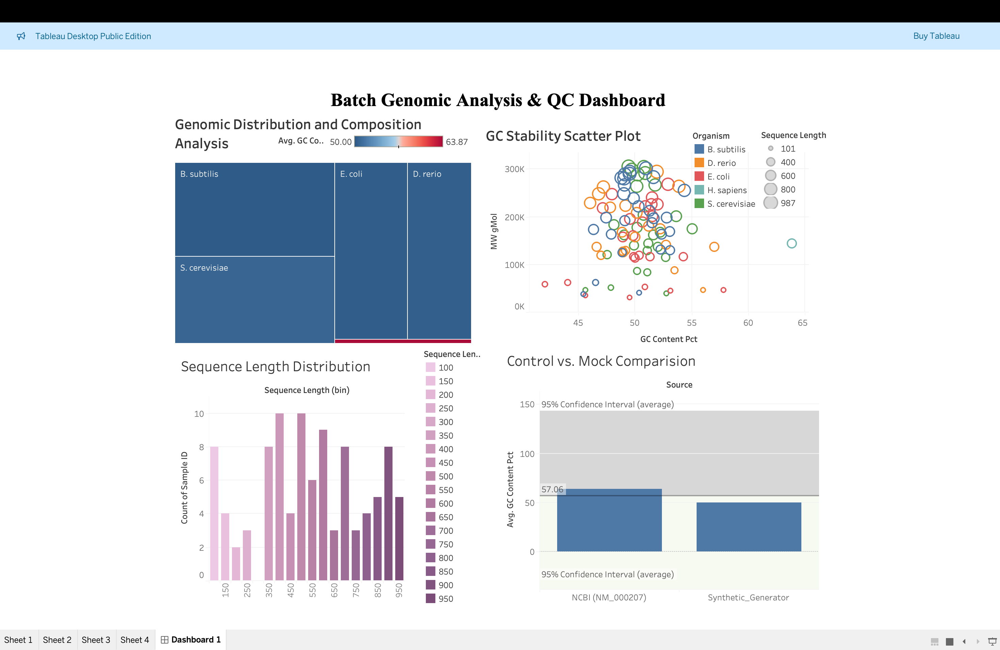

# BioStream Analytics: End-to-End Genomic Data Pipeline

## 📊 Interactive QC Dashboard
**Click the image below to explore the live interactive dashboard on Tableau Public:**

[](https://public.tableau.com/app/profile/chitra.kulkarni)

---

## 🧪 Project Overview
**BioStream Analytics** is a high-performance data engineering workstation. As a **MSc Biochemistry graduate**, I developed this pipeline to automate the journey from raw genetic sequences to laboratory insights.

### 🛠️ The Data Lifecycle
1. **Extraction:** Fetches real DNA sequences via **NCBI Entrez API** (Python).
2. **Transformation:** Calculates $GC\%$ content and Molecular Weight (Pandas).
3. **Loading:** Migrates processed data into a structured **SQL database** (SQLite).
4. **Analytics:** Visualizes batch quality and species distribution (**Tableau**).

---

## 🚀 Key Features
* **NCBI Control:** Uses the Human Insulin (INS) gene as a biological gold-standard.
* **SQL Suite:** Includes optimized queries for filtering genomic stability.
* **GUI Workstation:** A CustomTkinter interface for real-time sequence analysis.

---

## 📂 Repository Structure
```text
├── app/
│   └── biostream_pro.py        # GUI Application
├── scripts/
│   ├── data_generator.py       # API & Mock Data Logic
│   └── db_loader.py            # SQL Migration
├── data/
│   └── BioResearch.db          # Relational Database
├── dashboard.png               # Dashboard Preview Image
└── README.md

📦 Installation
git clone https://github.com/YourUsername/BioStream-Analytics.git

pip install -r requirements.txt

Run scripts/data_generator.py then app/biostream_pro.py.